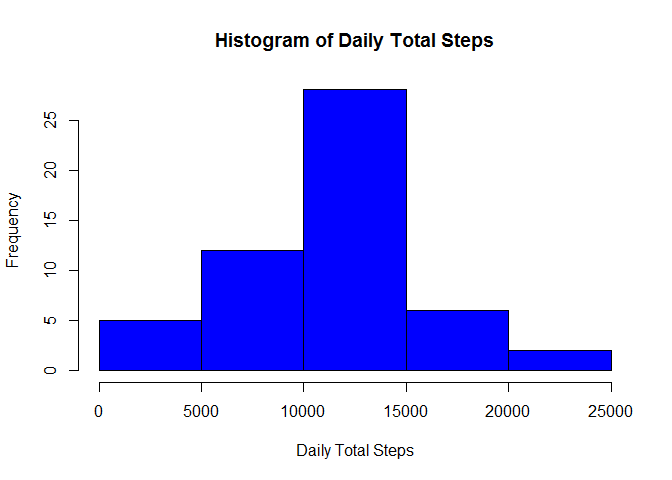
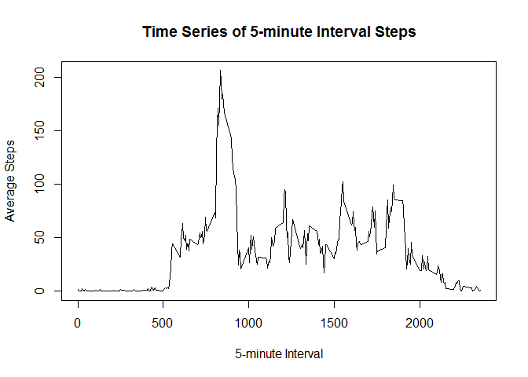
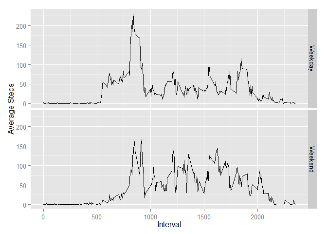

# Reproducible Research: Peer Assessment 1


## Loading and preprocessing the data


```r
  library(plyr)
```

```
## Warning: package 'plyr' was built under R version 3.1.2
```

```r
  library(ggplot2)
```

```
## Warning: package 'ggplot2' was built under R version 3.1.2
```

```r
  library(data.table)
```

```
## Warning: package 'data.table' was built under R version 3.1.2
```

```r
  filePath <- c("./activity.csv")
  activities <- read.csv(filePath, header = TRUE)
  act <- subset(activities, steps != "NA")
```
## Sample of activity data

```r
head(activities, n = 5L)
```

```
##   steps       date interval
## 1    NA 2012-10-01        0
## 2    NA 2012-10-01        5
## 3    NA 2012-10-01       10
## 4    NA 2012-10-01       15
## 5    NA 2012-10-01       20
```

## What is mean total number of steps taken per day?
<p> Calculating Total steps taken per day.

```r
  DailyTotal <- ddply(act, c("date"),summarize,TotalSteps=sum(steps))
  hist(DailyTotal$TotalSteps, main="Histogram of Daily Total Steps", xlab="Daily Total Steps", col=c("blue"))
```

 


```r
  MedianSteps <- format(median(DailyTotal$TotalSteps),big.mark=",")
  MeanSteps <- format(mean(DailyTotal$TotalSteps),digits=2,nsmall=1,big.mark=",")
```
<p> The mean steps are 10,766.2.  Median steps are 10,765.

## What is the average daily activity pattern?

```r
  IntervalAvg <- ddply(act, c("interval"),summarize,avgsteps=mean(steps))
  plot(IntervalAvg$interval, IntervalAvg$avgsteps, type = "l", main="Time Series of 5-minute Interval Steps",xlab ="5-minute Interval", ylab = "Average Steps")
```

 

```r
  MaxInterval <- format(IntervalAvg[IntervalAvg$avgsteps==max(IntervalAvg$avgsteps),1])
```
<p> The interval with highest average steps is 835.  

## Imputing missing values

```r
  MissingValues = format(nrow(activities[is.na(activities$steps),]),big.mark=",")
```
<p> The total number of missing values is 2,304.  The 5-minute interval average across all days is being used as imputed values for intervals with missing data.

```r
  activities <- merge(activities, IntervalAvg, by.x = "interval", by.y = "interval")
  activities <- rename(activities,c("avgsteps"="imputedsteps"))
  activities[!is.na(activities$steps),c("imputedsteps")] <- activities[!is.na(activities$steps),c("steps")]
  ImpDailyTotal <- ddply(activities, c("date"),summarize,TotalImputedSteps=sum(imputedsteps))
  hist(ImpDailyTotal$TotalImputedSteps, main="Histogram of Daily Total Steps with Imputed Data", xlab="Daily Total Steps", col=c("green"))
```

 

```r
  ImpMedianSteps <- format(median(ImpDailyTotal$TotalImputedSteps),big.mark=",")
  ImpMeanSteps <- format(mean(ImpDailyTotal$TotalImputedSteps),digits=2,nsmall=1,big.mark=",")
```
<p> The mean steps with imputed data are 10,766.2.  Median steps are 10,766.19.  These values are relatively the same as the mean and median with missing data points. 


## Are there differences in activity patterns between weekdays and weekends?

```r
  activities$dayofweek <- weekdays(as.Date(activities$date))
  activities[activities$dayofweek %in% c("Saturday","Sunday"),c("weekend")] <- c("Weekend")
  activities[activities$dayofweek %in% c("Monday","Tuesday","Wednesday","Thursday","Friday"),c("weekend")] <- c("Weekday")
  activities$weekend <- factor(activities$weekend)

  ImpIntervalAvg <- ddply(activities, .(interval,weekend),summarize,avgimpsteps=mean(imputedsteps))
  
  g <- qplot(interval, avgimpsteps, data=ImpIntervalAvg, facets = weekend ~ ., geom=c("line"))
  g + labs(x = "Interval") + labs(y="Average Steps")
```

 
